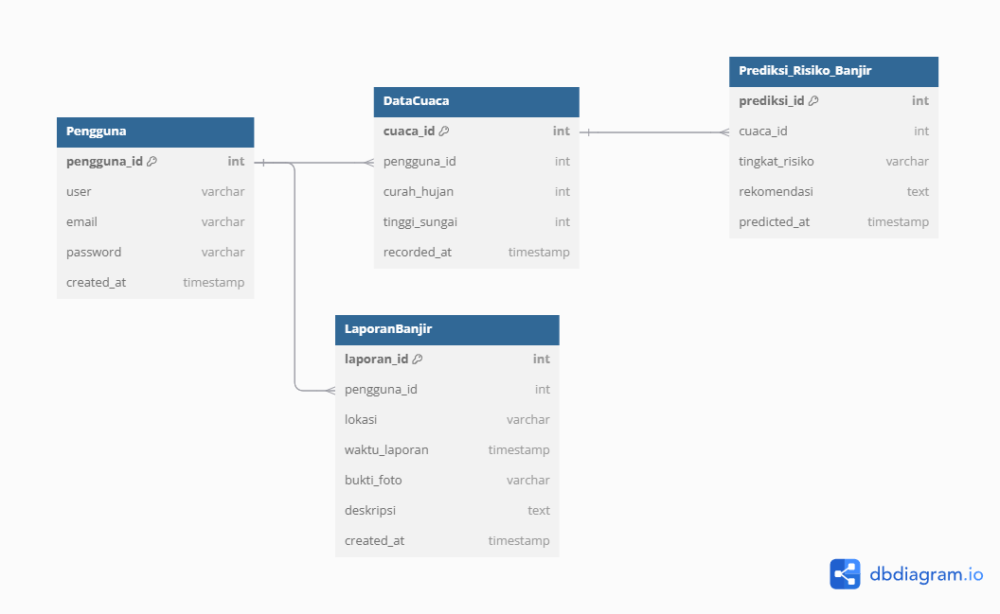
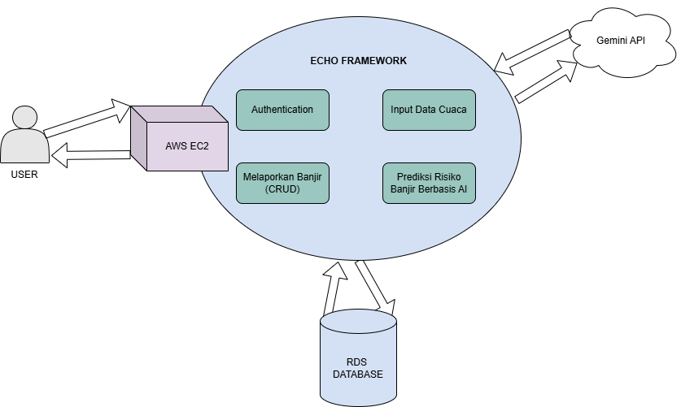
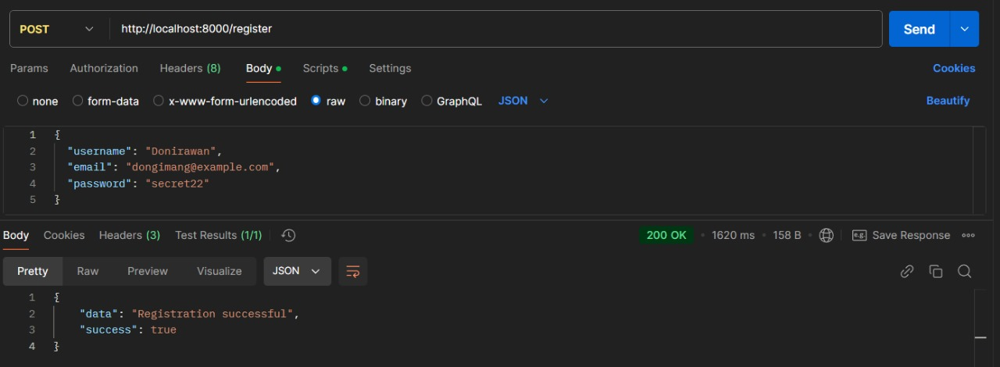
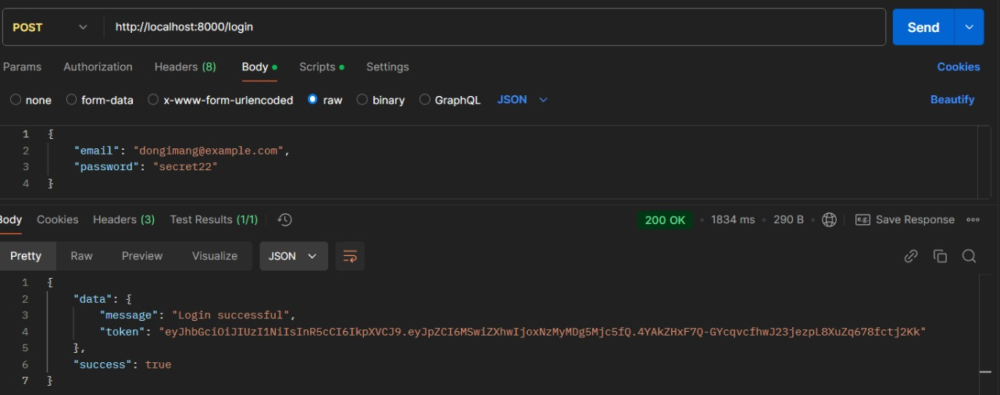
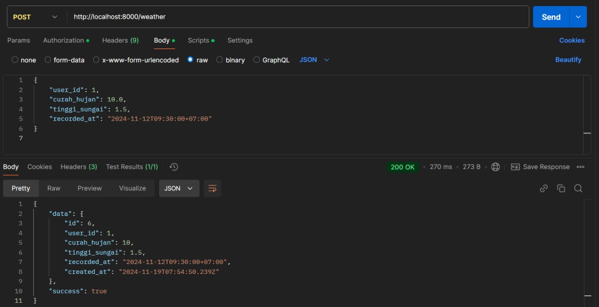
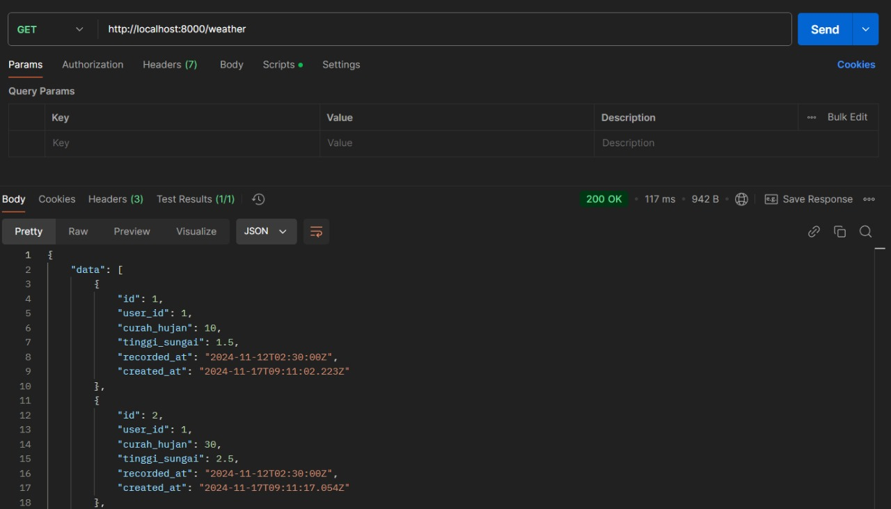
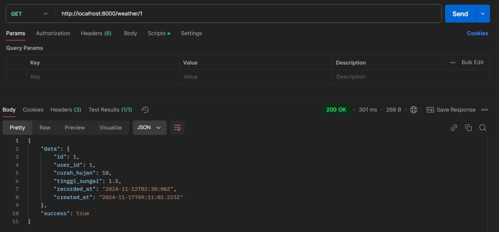
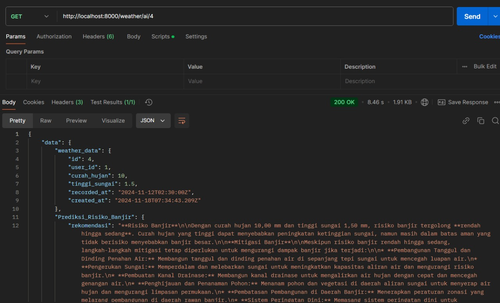

# Sistem Peringatan Dini Banjir 🌊

API ini adalah proyek mini yang dibangun dengan Golang untuk memantau dan mengelola data cuaca. Sistem ini menggunakan analisis berbasis AI untuk memberikan alert dan rekomendasi mitigasi risiko banjir.

---

## Fitur Utama ✨

- **Registrasi Pengguna**:
  - Pengguna dapat membuat akun untuk mengakses layanan.
- **Login/Logout**:
  - Autentikasi menggunakan JWT untuk mengamankan akses.
- **Pengelolaan Data Cuaca**:
  - Input data curah hujan dan tinggi sungai untuk analisis.
- **Analisis Berbasis AI**:
  - Memberikan alert dan rekomendasi tindakan untuk mitigasi risiko banjir berdasarkan data cuaca.

---


## Daftar Isi 📋

1. [Entity Relationship Diagram (ERD)](#entity-relationship-diagram-erd)
2. [High-Level Architecture Diagram (HLA)](#high-level-architecture-diagram-hla)
3. [Dokumentasi API](#dokumentasi-api)
4. [Teknologi yang Digunakan](#teknologi-yang-digunakan)
5. [Contoh Hasil Postman](#contoh-hasil-postman)

---

## Entity Relationship Diagram (ERD) 🗺️

Berikut adalah diagram hubungan entitas yang digunakan dalam proyek ini




### Penjelasan Tabel:

#### **1. Tabel `Pengguna`**

Tabel ini digunakan untuk menyimpan data pengguna yang terdaftar dalam sistem.

- **Kolom**:

  - `pengguna_id` (int): **Primary Key** untuk mengidentifikasi setiap pengguna secara unik.
  - `user` (varchar): Nama pengguna.
  - `email` (varchar): Email pengguna untuk autentikasi.
  - `password` (varchar): Password pengguna yang disimpan dalam bentuk hash.
  - `created_at` (timestamp): Waktu pembuatan akun.
- **Hubungan**:

  - Tabel ini memiliki hubungan **one-to-many** dengan tabel `DataCuaca` dan `LaporanBanjir`.

---

#### **2. Tabel `DataCuaca`**

Tabel ini digunakan untuk menyimpan data cuaca yang diinputkan oleh pengguna.

- **Kolom**:

  - `cuaca_id` (int): **Primary Key** untuk mengidentifikasi setiap data cuaca secara unik.
  - `pengguna_id` (int): **Foreign Key** yang merujuk ke `pengguna_id` di tabel `Pengguna`.
  - `curah_hujan` (int): Nilai curah hujan (mm).
  - `tinggi_sungai` (int): Tinggi muka air sungai (meter).
  - `recorded_at` (timestamp): Waktu pencatatan data cuaca.
- **Hubungan**:

  - Memiliki hubungan **many-to-one** dengan tabel `Pengguna`.
  - Memiliki hubungan **one-to-one** dengan tabel `Prediksi_Risiko_Banjir`.

---

#### **3. Tabel `Prediksi_Risiko_Banjir`**

Tabel ini menyimpan hasil analisis AI terkait risiko banjir berdasarkan data cuaca.

- **Kolom**:

  - `prediksi_id` (int): **Primary Key** untuk mengidentifikasi setiap prediksi.
  - `cuaca_id` (int): **Foreign Key** yang merujuk ke `cuaca_id` di tabel `DataCuaca`.
  - `tingkat_risiko` (varchar): Tingkat risiko banjir (misalnya: "Rendah", "Sedang", "Tinggi").
  - `rekomendasi` (text): Rekomendasi tindakan mitigasi risiko banjir.
  - `predicted_at` (timestamp): Waktu prediksi dihasilkan.
- **Hubungan**:

  - Memiliki hubungan **one-to-one** dengan tabel `DataCuaca`.

---

#### **4. Tabel `LaporanBanjir`**

Tabel ini digunakan untuk menyimpan laporan banjir dari pengguna.

- **Kolom**:

  - `laporan_id` (int): **Primary Key** untuk mengidentifikasi setiap laporan.
  - `pengguna_id` (int): **Foreign Key** yang merujuk ke `pengguna_id` di tabel `Pengguna`.
  - `lokasi` (varchar): Lokasi tempat banjir dilaporkan.
  - `waktu_laporan` (timestamp): Waktu ketika banjir terjadi.
  - `bukti_foto` (varchar): Lokasi file atau URL gambar bukti banjir.
  - `deskripsi` (text): Penjelasan detail dari laporan banjir.
  - `created_at` (timestamp): Waktu pembuatan laporan.
- **Hubungan**:

  - Memiliki hubungan **many-to-one** dengan tabel `Pengguna`.

---

### Hubungan Antar Tabel

1. **Pengguna → DataCuaca**:
   - Satu pengguna dapat memasukkan banyak data cuaca.
2. **DataCuaca → Prediksi_Risiko_Banjir**:
   - Satu data cuaca hanya memiliki satu prediksi risiko banjir.
3. **Pengguna → LaporanBanjir**:
   - Satu pengguna dapat membuat banyak laporan banjir.

---


## High-Level Architecture Diagram (HLA) 🏗️

Berikut adalah diagram arsitektur tingkat tinggi untuk **Sistem Peringatan Dini Banjir**:



### Komponen Utama:

1. **Pengguna (User)**:

   - Pengguna berinteraksi dengan sistem melalui API atau antarmuka (frontend jika ada) untuk:
     - Registrasi dan login.
     - Memasukkan data cuaca.
     - Melaporkan banjir.
     - Melihat prediksi risiko banjir dan rekomendasi mitigasi.
2. **AWS EC2**:

   - Sistem backend di-deploy menggunakan **AWS EC2**, yang berfungsi sebagai server utama untuk memproses semua request pengguna.
   - Menjalankan logika aplikasi seperti autentikasi, pengelolaan data cuaca, prediksi banjir, dan laporan banjir.
3. **Echo Framework (Backend)**:

   - Framework berbasis **Golang** yang digunakan untuk membangun API REST backend.
   - Komponen utama di backend:
     - **Authentication**:
       - Mengelola registrasi, login, dan validasi token JWT.
     - **Input Data Cuaca**:
       - Endpoint untuk pengguna memasukkan data curah hujan dan tinggi sungai.
     - **Prediksi Risiko Banjir Berbasis AI**:
       - Mengirim data cuaca ke API eksternal (**Gemini API**) untuk analisis risiko banjir dan menghasilkan rekomendasi.
     - **Melaporkan Banjir (CRUD)**:
       - Endpoint untuk pengguna membuat, membaca, memperbarui, dan menghapus laporan banjir (termasuk lokasi, deskripsi, dan bukti foto).
4. **Gemini API (AI)**:

   - API eksternal yang digunakan untuk memproses data cuaca (curah hujan, tinggi sungai) dan menghasilkan prediksi risiko banjir serta rekomendasi tindakan mitigasi.
   - Data dikirim dari backend ke API ini, dan hasilnya dikembalikan untuk disimpan di database dan ditampilkan ke pengguna.
5. **RDS Database**:

   - Database relasional yang digunakan untuk menyimpan:
     - Data pengguna (registrasi dan login).
     - Data cuaca yang diinputkan pengguna.
     - Prediksi risiko banjir dan rekomendasi dari Gemini API.
     - Laporan banjir yang dibuat oleh pengguna.

---


## Dokumentasi API 📖

### Fitur Autentikasi

| No | Method | Endpoint  | Request Body                                             | Deskripsi                            |
| -- | ------ | --------- | -------------------------------------------------------- | ------------------------------------ |
| 1  | POST   | /register | `{ "email": "test@example.com", "password": "12345" }` | Registrasi pengguna baru             |
| 2  | POST   | /login    | `{ "email": "test@example.com", "password": "12345" }` | Login pengguna dan mendapatkan token |

---

### Fitur Manajemen Data Cuaca

| No | Method | Endpoint      | Request Body                                                                            | Deskripsi                             |
| -- | ------ | ------------- | --------------------------------------------------------------------------------------- | ------------------------------------- |
| 1  | GET    | /weather      | -                                                                                       | Mendapatkan seluruh data cuaca        |
| 2  | GET    | /weather/{id} | -                                                                                       | Mendapatkan data cuaca berdasarkan ID |
| 3  | POST   | /weather      | `{ "curah_hujan": 80, "tinggi_sungai": 3.5, "recorded_at": "2024-11-17T10:00:00Z" }`  | Menambahkan data cuaca baru           |
| 4  | PUT    | /weather/{id} | `{ "curah_hujan": 100, "tinggi_sungai": 4.0, "recorded_at": "2024-11-18T15:00:00Z" }` | Memperbarui data cuaca berdasarkan ID |
| 5  | DELETE | /weather/{id} | -                                                                                       | Menghapus data cuaca berdasarkan ID   |

---

### Fitur Pelaporan Banjir

| No | Method | Endpoint      | Request Body                                                                                        | Deskripsi                                 |
| -- | ------ | ------------- | --------------------------------------------------------------------------------------------------- | ----------------------------------------- |
| 1  | GET    | /reports      | -                                                                                                   | Mendapatkan seluruh laporan banjir        |
| 2  | GET    | /reports/{id} | -                                                                                                   | Mendapatkan laporan banjir berdasarkan ID |
| 3  | POST   | /reports      | `{ "lokasi": "Jakarta", "waktu_laporan": "2024-11-17T15:00:00Z", "deskripsi": "Banjir tinggi" }`  | Membuat laporan banjir baru               |
| 4  | PUT    | /reports/{id} | `{ "lokasi": "Bandung", "waktu_laporan": "2024-11-18T15:00:00Z", "deskripsi": "Surut sebagian" }` | Memperbarui laporan banjir berdasarkan ID |
| 5  | DELETE | /reports/{id} | -                                                                                                   | Menghapus laporan banjir berdasarkan ID   |

### Fitur Prediksi Risiko Banjir Berbasis AI

| No | Method | Endpoint         | Request Body | Deskripsi                                                            |
| -- | ------ | ---------------- | ------------ | -------------------------------------------------------------------- |
| 1  | GET    | /weather/ai/{id} | -            | Mendapatkan prediksi risiko banjir dari AI berdasarkan ID data cuaca |

## Cara Instalasi 🛠️

### 1. Clone Repository

Clone repositori proyek dari GitHub ke komputer lokal Anda:

```bash
git clone https://github.com/donirawans/Doni-Irawan-Golang-Mini-Project.git
cd Doni-Irawan-Golang-Mini-Project
```

### 2. Setup File Konfigurasi

<pre class="!overflow-visible"><div class="contain-inline-size rounded-md border-[0.5px] border-token-border-medium relative bg-token-sidebar-surface-primary dark:bg-gray-950"><div class="flex items-center text-token-text-secondary px-4 py-2 text-xs font-sans justify-between rounded-t-md h-9 bg-token-sidebar-surface-primary dark:bg-token-main-surface-secondary select-none">bash</div><div class="sticky top-9 md:top-[5.75rem]"><div class="absolute bottom-0 right-2 flex h-9 items-center"><div class="flex items-center rounded bg-token-sidebar-surface-primary px-2 font-sans text-xs text-token-text-secondary dark:bg-token-main-surface-secondary"><span class="" data-state="closed"><button class="flex gap-1 items-center select-none py-1"><svg width="24" height="24" viewBox="0 0 24 24" fill="none" xmlns="http://www.w3.org/2000/svg" class="icon-sm"><path fill-rule="evenodd" clip-rule="evenodd" d="M7 5C7 3.34315 8.34315 2 10 2H19C20.6569 2 22 3.34315 22 5V14C22 15.6569 20.6569 17 19 17H17V19C17 20.6569 15.6569 22 14 22H5C3.34315 22 2 20.6569 2 19V10C2 8.34315 3.34315 7 5 7H7V5ZM9 7H14C15.6569 7 17 8.34315 17 10V15H19C19.5523 15 20 14.5523 20 14V5C20 4.44772 19.5523 4 19 4H10C9.44772 4 9 4.44772 9 5V7ZM5 9C4.44772 9 4 9.44772 4 10V19C4 19.5523 4.44772 20 5 20H14C14.5523 20 15 19.5523 15 19V10C15 9.44772 14.5523 9 14 9H5Z" fill="currentColor"></path></svg>Salin kode</button></span></div></div></div><div class="overflow-y-auto p-4" dir="ltr"><code class="!whitespace-pre hljs language-bash">cp .env.example .env
</code></div></div></pre>

Sesuaikan parameter di file `.env` seperti:

* `DB_HOST`
* `DB_USER`
* `DB_PASSWORD`
* `DB_NAME`
* `JWT_SECRET`
* `AI_API_KEY`

---

### 3. Install Dependencies

<pre class="!overflow-visible"><div class="contain-inline-size rounded-md border-[0.5px] border-token-border-medium relative bg-token-sidebar-surface-primary dark:bg-gray-950"><div class="flex items-center text-token-text-secondary px-4 py-2 text-xs font-sans justify-between rounded-t-md h-9 bg-token-sidebar-surface-primary dark:bg-token-main-surface-secondary select-none">bash</div><div class="sticky top-9 md:top-[5.75rem]"><div class="absolute bottom-0 right-2 flex h-9 items-center"><div class="flex items-center rounded bg-token-sidebar-surface-primary px-2 font-sans text-xs text-token-text-secondary dark:bg-token-main-surface-secondary"><span class="" data-state="closed"><button class="flex gap-1 items-center select-none py-1"><svg width="24" height="24" viewBox="0 0 24 24" fill="none" xmlns="http://www.w3.org/2000/svg" class="icon-sm"><path fill-rule="evenodd" clip-rule="evenodd" d="M7 5C7 3.34315 8.34315 2 10 2H19C20.6569 2 22 3.34315 22 5V14C22 15.6569 20.6569 17 19 17H17V19C17 20.6569 15.6569 22 14 22H5C3.34315 22 2 20.6569 2 19V10C2 8.34315 3.34315 7 5 7H7V5ZM9 7H14C15.6569 7 17 8.34315 17 10V15H19C19.5523 15 20 14.5523 20 14V5C20 4.44772 19.5523 4 19 4H10C9.44772 4 9 4.44772 9 5V7ZM5 9C4.44772 9 4 9.44772 4 10V19C4 19.5523 4.44772 20 5 20H14C14.5523 20 15 19.5523 15 19V10C15 9.44772 14.5523 9 14 9H5Z" fill="currentColor"></path></svg>Salin kode</button></span></div></div></div><div class="overflow-y-auto p-4" dir="ltr"><code class="!whitespace-pre hljs language-bash">go mod tidy
</code></div></div></pre>

---

### 4. Run Server

<pre class="!overflow-visible"><div class="contain-inline-size rounded-md border-[0.5px] border-token-border-medium relative bg-token-sidebar-surface-primary dark:bg-gray-950"><div class="flex items-center text-token-text-secondary px-4 py-2 text-xs font-sans justify-between rounded-t-md h-9 bg-token-sidebar-surface-primary dark:bg-token-main-surface-secondary select-none">bash</div><div class="sticky top-9 md:top-[5.75rem]"><div class="absolute bottom-0 right-2 flex h-9 items-center"><div class="flex items-center rounded bg-token-sidebar-surface-primary px-2 font-sans text-xs text-token-text-secondary dark:bg-token-main-surface-secondary"><span class="" data-state="closed"><button class="flex gap-1 items-center select-none py-1"><svg width="24" height="24" viewBox="0 0 24 24" fill="none" xmlns="http://www.w3.org/2000/svg" class="icon-sm"><path fill-rule="evenodd" clip-rule="evenodd" d="M7 5C7 3.34315 8.34315 2 10 2H19C20.6569 2 22 3.34315 22 5V14C22 15.6569 20.6569 17 19 17H17V19C17 20.6569 15.6569 22 14 22H5C3.34315 22 2 20.6569 2 19V10C2 8.34315 3.34315 7 5 7H7V5ZM9 7H14C15.6569 7 17 8.34315 17 10V15H19C19.5523 15 20 14.5523 20 14V5C20 4.44772 19.5523 4 19 4H10C9.44772 4 9 4.44772 9 5V7ZM5 9C4.44772 9 4 9.44772 4 10V19C4 19.5523 4.44772 20 5 20H14C14.5523 20 15 19.5523 15 19V10C15 9.44772 14.5523 9 14 9H5Z" fill="currentColor"></path></svg>Salin kode</button></span></div></div></div><div class="overflow-y-auto p-4" dir="ltr"><code class="!whitespace-pre hljs language-bash">go run main.go
</code></div></div></pre>

---

Setelah server berjalan, API dapat diakses melalui:

* **URL** : `http://localhost:8080`

---


## Teknologi yang Digunakan 🛠️

Proyek **Sistem Peringatan Dini Banjir** menggunakan teknologi berikut:

- **Bahasa Pemrograman**: Golang
- **Framework**: Echo Framework (untuk membangun RESTful API)
- **Database**: MySQL (Amazon RDS sebagai penyimpanan relasional)
- **Autentikasi**: JSON Web Token (JWT) untuk memastikan keamanan akses API
- **AI**: Google Generative AI (Gemini API) untuk analisis risiko banjir dan rekomendasi tindakan mitigasi

---


## Contoh Hasil Postman 🛠️

Berikut adalah contoh hasil pengujian API menggunakan **Postman**:

---

### 1. User Autentikasi

#### **Registrasi**

- **Endpoint**: `POST /register`
- **Tangkapan Layar**:
  

---

#### **Login**

- **Endpoint**: `POST /login`
- **Tangkapan Layar**:
  


### 2. CRUD Data Cuaca

#### **Menambahkan Data**

- **Endpoint**: `POST /airquality`
- **Tangkapan Layar**:
  

---

#### **Melihat Semua Data**

- **Endpoint**: `GET /airquality`
- **Tangkapan Layar**:
  

---

#### **Melihat Data Berdasarkan ID**

- **Endpoint**: `GET /airquality/{id}`
- **Tangkapan Layar**:
  

---

#### **Menghapus Data**

- **Endpoint**: `DELETE /airquality/{id}`
- **Tangkapan Layar**:
  

### 2. Rekomendasi dari AI

#### *Respon AI*

- *Endpoint*: GET /weatherai{id}
- *Tangkapan Layar*:
  
